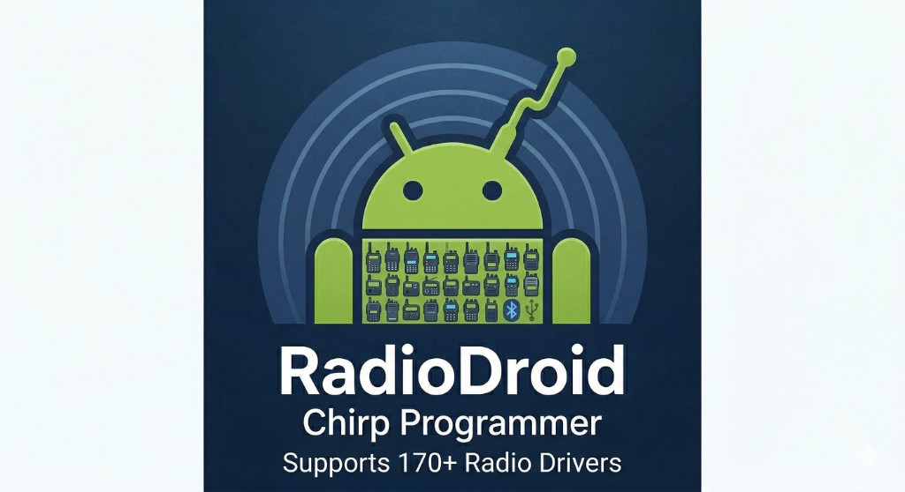

<p align="center">
  
</p>

# RadioDroid

**Android CHIRP-compatible universal radio programmer**

RadioDroid brings the full [CHIRP](https://chirp.app) radio programming ecosystem to Android. It runs existing validated CHIRP Python drivers natively on the device via [Chaquopy](https://chaquo.com/chaquopy/), enabling USB OTG and Bluetooth LE connections to 170+ supported radios — no PC required.

## Features

- 📻 **170+ radios** via bundled CHIRP Python drivers (Baofeng, TID Radio, Yaesu, Kenwood, and more)
- 🔌 **USB OTG** — connect any CHIRP-supported radio via USB cable
- 📶 **Bluetooth LE** — wireless programming via BLE-to-serial adapters (**v2.1+**: supports common UART service profiles — HM-10/TI-style, Nordic UART, Microchip/ISSC, NICFW/TD-H3; scan is filtered to those services; safer MTU negotiation with 20-byte fallback for flaky dongles)
- ✏️ **Full channel editing** — frequency, tone (CTCSS/DCS), power, mode, name
- 🎛️ **Radio-specific channel fields** — spinners/switches where the CHIRP driver defines options (after download / clone image)
- ⚙️ **Radio settings** — driver-defined global settings with **search** (filter by name or value)
- 📋 **CHIRP CSV import/export** — share channels with desktop CHIRP or other users
- 🔍 **Channel search** — filter by name, group, or frequency
- 📖 **[Online user guide](https://jnyer27.github.io/RadioDroid/)** — MkDocs site + PDF on [Releases](https://github.com/jnyer27/RadioDroid/releases)

### What’s new in **v4.1.0**

- **Maintainers** — **Cursor skill** for **CHIRP submodule** hygiene (avoid checkout drift vs pinned commit). **Docs** — **`docs/index.md`** release line synced with the app. See [release notes](release_notes_v4.1.0.md).

### Earlier: **v4.0.0**

- **NICFW TD-H3 2.5** — **Driver `validate_memory`** for **mode vs bandwidth**; **mmap apply** and **channel editor / bulk** use the same rules; **DCS** stored as **code-table index** (fixes **025** vs **021**); **50–600 MHz** **`valid_bands`** for RX-aligned validation. See [release notes](release_notes_v4.0.0.md).

### Earlier: **v3.5.0**

- **Dense channel cards** — Main list rows use **inline badges**, a dedicated **frequency** line, an optional **tone** summary, and a **single radio-specific summary** (merged groups, hidden empty/None, readable labels). See [release notes](release_notes_v3.5.0.md).

### Earlier: **v3.4.0**

- **Play-ready release builds** — **R8** + resource shrinking, **NDK debug symbol** settings for native crash reports, and ProGuard rules for **Chaquopy** / USB serial. See [release notes](release_notes_v3.4.0.md) (includes the full **Security review** from the codebase review, not a penetration test).
- **Custom driver warning** — **Select Radio Model** shows a trust reminder before you choose a custom **`.py`** CHIRP driver file.

### Earlier: **v3.3.0**

- **CHIRP interchange** — **NICFW TD-H3 2.5** uses **`NFM`** / **`NAM`** in **`Memory.mode`** (per **`chirp_common.MODES`**) with correct EEPROM narrow-band round-trip. **CHIRP CSV** export/import matches **`Memory.CSV_FORMAT`** (full tone columns, **RxDtcsCode**, **CrossMode**) and passes **MODES** through for desktop CHIRP compatibility. See [release notes](release_notes_v3.3.0.md).

### Earlier: **v3.2.0**

- **Display cutout / foldables** — Toolbars clear **punch-holes and notches**; **Radio select**, CSV import, and **Customize main screen** match edge-to-edge insets. **User guide** updated for bulk **radio-specific** action and multi-select. See [release notes](release_notes_v3.2.0.md).

### Earlier: **v3.1.0**

- **Channel list radio-specific row** — extras render as a **stable vertical list** (no width-dependent columns), fixing missing or wrong layouts until rotation. See [release notes](release_notes_v3.1.0.md).

### Earlier: **v3.0.0**

- **Extras-only channel model** — no universal **Group 1–4**; radio-specific fields use **Memory.extra** (schema UI + bulk edit). **Clone backup** merges JSON **`channels[].extra`** into the EEPROM image; mmap sync works without editing vendor CHIRP drivers; **Export Raw EEPROM** shows the same progress UI as backup export. See [release notes](release_notes_v3.0.0.md).

### Earlier: **v2.5.0**

- **Slim radio backup JSON** — export stores settings as **`path` + `value` only**; **Vendor_Model** prefixes on backup and raw EEPROM filenames; **clone import** merges JSON **settings** into the EEPROM image; export shows progress and better errors; **NICFW H3** backup/export fixes. See [release notes](release_notes_v2.5.0.md).
- **CHIRP submodule** — bundled CHIRP tracks **[jnyer27/chirp](https://github.com/jnyer27/chirp)** for RadioDroid-only driver commits; [docs/CHIRP_SUBMODULE.md](docs/CHIRP_SUBMODULE.md).

### Earlier: **v2.4.0**

- **Radio-specific channel row** — extras on the main list (v2.4–v3.0 used multi-column reflow; **v3.1+** uses a vertical list for reliable `RecyclerView` layout). See [release notes](release_notes_v2.4.0.md).
- **Channel editor** — **Busy Lock** is no longer duplicated when the driver already shows it under Radio-specific settings (e.g. nicFW H3).

### Earlier: **v2.3.0**

- **Channel edits now persist to EEPROM** — fixed a bitwise `TypeError` in the nicFW H3 CHIRP driver where `MemoryMapBytes` single-byte reads return `bytes` not `int`; all channel edits now survive export/re-import.
- **Export Raw EEPROM re-enabled after JSON import** — the channel editor no longer clears the in-memory EEPROM when opened.
- **Channel editor spinners/switches restored after JSON import** — clone-mode drivers can now return field schemas from an existing in-memory EEPROM even when the JSON backup has no embedded EEPROM bytes.
- **DCS tone encoding corrected** — fixed octal/binary mismatch in nicFW H3 `_decode_tone`/`_encode_tone`. See [release notes](release_notes_v2.3.0.md).

### Earlier: **v2.2.0**

- **Radio transfer feedback** — **Load from radio** / **Save to radio** show an indeterminate progress bar and rotating status messages so it’s clear work is ongoing (replacing a stale “cloning… 0 / 256” style indicator). See [release notes](release_notes_v2.2.md).

### Earlier: **v2.1.0**

- **BLE compatibility** — Multiple UART service UUIDs, filtered BLE scan, and conservative MTU handling so more cheap Chinese BLE-to-serial dongles work reliably (Baofeng-style, Nordic, Microchip/ISSC, NICFW).
- **Docs** — README and [user guide](https://jnyer27.github.io/RadioDroid/) updated for this release.

## CHIRP submodule (fork)

The bundled CHIRP tree is a **Git submodule** pointing at **[github.com/jnyer27/chirp](https://github.com/jnyer27/chirp)** (RadioDroid-maintained fork), not kk7ds/chirp directly. That keeps Android-specific driver commits (e.g. nicFW H3 fixes) **cloneable** with the app repo.

- Maintainer workflow: [docs/CHIRP_SUBMODULE.md](docs/CHIRP_SUBMODULE.md)
- Clone with submodules: `git clone --recurse-submodules https://github.com/jnyer27/RadioDroid.git`

## Architecture

RadioDroid uses [Chaquopy](https://chaquo.com/chaquopy/) to run CPython 3.13 on Android. Existing CHIRP drivers run unmodified; a thin `serial_shim.py` bridges the CHIRP `serial.Serial` interface to Android's USB Host API (via `usbserial4a`) and BLE (via a `LocalSocket` relay).

```
UI (Kotlin) → ChirpBridge.kt → chirp_bridge.py → CHIRP driver → AndroidSerial → Radio
```

## Requirements

- Android 7.0+ (API 24)
- USB OTG cable **or** BLE-capable Android device

**Release builds:** signed APKs are attached to [GitHub Releases](https://github.com/jnyer27/RadioDroid/releases) (e.g. `app-release.apk` for v4.1.0).

## Related

- [Privacy policy](privacypolicy.md) — data handling for the official app; [online copy](https://jnyer27.github.io/RadioDroid/privacy-policy/) on the user guide site
- [NICFW TD-H3 Channel Editor](https://github.com/jnyer27/NICFW-H3-25-CHIRP-ADAPTER) — TID H3-specific editor with nicFW 2.5 advanced features
- [CHIRP](https://github.com/kk7ds/chirp) — the open-source radio programming project this app builds upon
